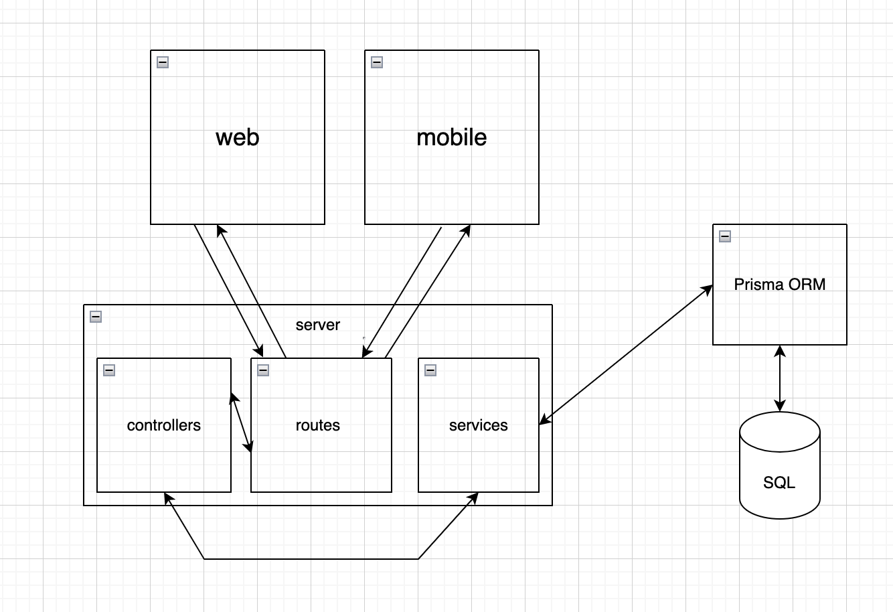

# Area 51

- [How to Setup](#how-to-setup)
- [How to contribute](#how-to-contribute)
- [Diagram](#diagram)
- [Stack :zap:](#stack-zap)
- [API Endpoints](#api-endpoints)
- [Contributors :sparkles:](#contributors-sparkles)

## How to Setup

- Copy environment variables. Replace values to your own.

```bash
cp .env.example .env
```

- Build the project with [docker-compose](https://docs.docker.com/compose/).

```bash
docker-compose build
```

- Start containers.

```bash
docker-compose up --detach
```

## How to contribute

#### Add a service

1. Create a file with service name in src/connectors folder which extends from Connector and implements IConnector
2. Implement the authenticate method which takes the code returned by the oauth as a parameter and returns the access_token
3. Next, you have to create two functions in ConnectorController (src/controllers/ConnectorController.ts)
    - First, create a function that returns the oauth url of the service
    - The second function is an express controller which allows you to retrieve the queries, validate them and send the code in the authenticate function implemented previously
4. Finally add and modify these two lines in the file src/routes/connector.route.ts
```javascript
router.get("/<service_name>", isAuthenticated, ConnectorController.<first_function_name>);
router.get("/<service_name>/authorize", ConnectorController.<second_function_name>);
```
5. In order for the oauth call to work, the redirect_uri parameter must be the route that calls the controller (second function, here: /<service_name>/authorize)

#### Add an action

1. To add an action, you must first create a service.
2. In src/prisma/seeder.ts, add a function which add a function which is called in main,
in it create the action (refer to other functions for implementation). Change name to the name of the webhook event.
3. Create fields for the action (fields are the inputs you ask the user for when choosing the action).
4. If you want populate a select. for example, to select values ​​retrieved via the API, add a field_<field_name> method in the connector. this method takes an array of Field. Refer to the GitHub.ts file to implement the logic.
5. Next, open the associated service file in the src/connectors folder
6. Implement the webhook function. This one takes in parameter workflow_id which is a number, event which is a string and a payload.
```javascript
async webhook(workflow_id: number, event: string, payload?: Object)
```
7. ```workflow_id``` is the id of the previously created workflow which must be added in the url that the webhook must call.
8. ```event``` is the name of the event.
9. ```payload``` is an object that includes previously created fields.
10. In the webhook method, call the api route of the service to which you want to add the action and put as url:
```javascript
${host}/workflow/callback/${workflow_id}
```

#### Add a reaction

1. To add a reaction, you must first create a service.
2. In src/prisma/seeder.ts, add a function which add a function which is called in main,
in it create the reaction (refer to other functions for implementation). Set the name that you want.
3. Create fields for the action (fields are the inputs you ask the user for when choosing the reaction).
4. If you want populate a select. for example, to select values ​​retrieved via the API, add a field_<field_name> method in the connector. this method takes an array of Field. Refer to the GitHub.ts file to implement the logic.
5. Next, open the associated service file in the src/connectors folder
6. Implement the method with the name you choose. This one takes a payload which is an object with all fields.
7. Finally, implement the logic of the reaction in this method.

## Diagram



## Stack :zap:

```javascript
    stack: [
        "nodejs",
        "typescript",
        "express",
        "prisma",
        "mysql",
        "reactjs",
        "react-native"
    ];
```

## API Endpoints

### <u>About</u>

| Method   | URL                                   | Description |
|----------|---------------------------------------|-------------|
| `GET`    | [`/about.json`](examples/about/get.md)| about.json  |

### <u>Auth</u>

| Method   | URL                                       | Description           |
|----------|-------------------------------------------|-----------------------|
| `POST`   | [`/auth/signup`](examples/auth/signup.md) | Sign up an account    |
| `POST`   | [`/auth/signin`](examples/auth/signin.md) | Sign in to an account |

### <u>Service</u>

| Method   | URL                                          | Description      |
|----------|----------------------------------------------|------------------|
| `POST`   | [`/service`](examples/service/post.md)       | Create a service |
| `GET`    | [`/service/:id`](examples/service/get.md)    | Get a service    |
| `PATCH`  | [`/service/:id`](examples/service/patch.md)  | Update a service |
| `DELETE` | [`/service/:id`](examples/service/delete.md) | Delete a service |

### <u>Action</u>

| Method   | URL                                                 | Description         |
|----------|-----------------------------------------------------|---------------------|
| `GET`    | [`/action/:id/fields`](examples/action/fields.md)   | Get action's fields |
| `POST`   | [`/action/:service`](examples/action/post.md)       | Create an action    |
| `GET`    | [`/action/:service/:id`](examples/action/get.md)    | Get an action       |
| `PATCH`  | [`/action/:service/:id`](examples/action/patch.md)  | Update an action    |
| `DELETE` | [`/action/:service/:id`](examples/action/delete.md) | Delete an action    |

### <u>Reaction</u>

| Method   | URL                                                     | Description           |
|----------|---------------------------------------------------------|-----------------------|
| `GET`    | [`/reaction/:id/fields`](examples/reaction/fields.md)   | Get reaction's fields |
| `POST`   | [`/reaction/:service`](examples/reaction/post.md)       | Create a reaction     |
| `GET`    | [`/reaction/:service/:id`](examples/reaction/get.md)    | Get a reaction        |
| `PATCH`  | [`/reaction/:service/:id`](examples/reaction/patch.md)  | Update a reaction     |
| `DELETE` | [`/reaction/:service/:id`](examples/reaction/delete.md) | Delete a reaction     |

### <u>Workflow</u>

| Method   | URL                                                       | Description         |
|----------|-----------------------------------------------------------|---------------------|
| `POST`   | [`/workflow`](examples/workflow/post.md)                  | Create a workflow   |
| `GET`    | [`/workflow/:id`](examples/workflow/get.md)               | Get a workflow      |
| `PATCH`  | [`/workflow/:id`](examples/workflow/patch.md)             | Update a workflow   |
| `DELETE` | [`/workflow/:id`](examples/workflow/delete.md)            | Delete a workflow   |
| `GET`    | [`/workflow/callback/:id`](examples/workflow/callback.md) | Callback a workflow |

### <u>Token</u>

| Method   | URL                                         | Description    |
|----------|---------------------------------------------|----------------|
| `POST`   | [`/token/:service`](examples/token/post.md) | Create a token |
| `GET`    | [`/token/:id`](examples/token/get.md)       | Get a token    |
| `PATCH`  | [`/token/:id`](examples/token/patch.md)     | Update a token |
| `DELETE` | [`/token/:id`](examples/token/delete.md)    | Delete a token |

### <u>Field</u>

| Method   | URL                                         | Description    |
|----------|---------------------------------------------|----------------|
| `POST`   | [`/field/`](examples/field/post.md)         | Create a field |
| `GET`    | [`/field/:id`](examples/field/get.md)       | Get a field    |
| `PATCH`  | [`/field/:id`](examples/field/patch.md)     | Update a field |
| `DELETE` | [`/field/:id`](examples/field/delete.md)    | Delete a field |

<table>
    <tbody>
        <tr>
            <td>
                <a href="https://github.com/Fusyony"><br /><sub><b>Matthéo Selingant</b></sub></a>
            </td>
            <td>
                <a href="https://github.com/Basile-LAMOTTE"><br /><sub><b>Basile Lamotte</b></sub></a>
            </td>
            <td>
                <a href="https://github.com/TomB-oss"><br /><sub><b>Tom Bartuzel</b></sub></a>
            </td>
            <td>
                <a href="https://github.com/phearoak"><br /><sub><b>Phearoak Em</b></sub></a>
            </td>
            <td>
                <a href="https://github.com/evandelagnes"><br /><sub><b>Evan Delagnes</b></sub></a>
            </td>
        </tr>
    </tbody>
</table>
